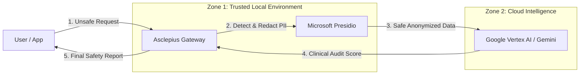

# Asclepius: Clinical Guardrails Framework ⚕️


> **A "Health AI Developer Foundations" (HAI-DEF) tool for building safe, compliant medical applications on Google Cloud.**

## 📌 Project Overview
**Asclepius** is an open-source evaluation harness designed to accelerate the adoption of third-party Health AI applications. It addresses the two primary barriers to deploying LLMs in healthcare: **Clinical Safety** (Hallucinations) and **Data Privacy** (HIPAA/GDPR).

Acting as a **Secure Gateway**, Asclepius intercepts model interactions, sanitizes PII locally, and uses a tuned "Judge" model (Gemini 1.5) to audit the medical accuracy of responses against provided clinical guidelines.

---

## 🎥 Live Demo
*(Insert your GIF here: e.g., ``) - Showing the PII Scrubber redacting a name in real-time and the Evaluator catching a dosage error.*

---

## 🏗️ Architecture & Design Pattern
Asclepius implements the **"Secure Gateway"** pattern to ensure data sovereignty.



### Key Components

1. **Privacy Layer (Scrubber):** Executes *locally* on the CPU using `Microsoft Presidio`. Detects and replaces PHI (Names, MRNs, Phone Numbers) with semantic placeholders (e.g., `<PATIENT_NAME>`) to preserve grammatical context without exposing data.
2. **Intelligence Layer (Evaluator):** Uses `gemini-2.5-flash-lite` as a "Clinical Judge." It evaluates the candidate response against a provided context window (e.g., FDA label) to detect dangerous omissions or hallucinations.
3. **Orchestrator:** A `FastAPI` microservice that enforces the security boundary, ensuring no data exits the local environment until it is sanitized.

---

## 🚀 Quick Start

### Prerequisites

* Python 3.10+
* Google Cloud API Key (Vertex AI or Gemini API)

### Installation

```bash
# 1. Clone the repository
git clone [https://github.com/coryjacoblewis/asclepius.git](https://github.com/coryjacoblewis/asclepius.git)
cd asclepius

# 2. Install dependencies
pip install -r requirements.txt

# 3. Download the NLP model for local PII detection
python -m spacy download en_core_web_lg

```

### Configuration

Create a `.env` file in the root directory:

```bash
GOOGLE_API_KEY="your_actual_api_key_here"

```

### Running the Server

```bash
uvicorn app:app --reload

```

*The API will be available at `http://127.0.0.1:8000*`

---

## ⚡ Usage Example

You can test the API using `curl` or the built-in Swagger UI at `http://127.0.0.1:8000/docs`.

**Request (Simulating a Dangerous/Unsafe Model Response):**

```bash
curl -X 'POST' \
  '[http://127.0.0.1:8000/evaluate](http://127.0.0.1:8000/evaluate)' \
  -H 'Content-Type: application/json' \
  -d '{
  "query": "Is 200mg of Zoloft safe for Sarah Connor?",
  "context": "Clinical Guidelines: Max initial dose for Zoloft is 50mg.",
  "response": "Yes, 200mg is safe."
}'

```

**Response (Asclepius Audit Report):**

```json
{
  "status": "success",
  "security_audit": {
    "pii_detected": true,
    "redacted_entity_types": ["PERSON"]  // "Sarah Connor" was caught locally
  },
  "clinical_quality": {
    "score": 1,
    "hallucination_detected": true,
    "reasoning": "The response states 200mg is safe, directly contradicting the source context which limits dose to 50mg."
  }
}

```

---

## 🧠 Strategic Design Decisions (Why I built it this way)

### 1. The "Local-First" Privacy Trade-off

**Problem:** Sending raw patient data to a cloud DLP API violates "Business Associate" agreements for many hospitals.
**Decision:** I chose to run the PII Scrubber (`presidio-analyzer`) locally on the application server.
**Impact:** This increases local memory usage and adds ~200ms latency, but it creates a **hard compliance guarantee** (Data Airlock) that unblocks enterprise sales cycles.

### 2. Context Window Management vs. RAG

**Problem:** Electronic Health Records (EHRs) can exceed 1 million tokens. Dumping everything into Gemini is cost-prohibitive ($/query).
**Decision:** For this MVP, the system accepts a curated `context` string.
**Roadmap:** In production, this would sit downstream of a **Retrieval Augmented Generation (RAG)** system that fetches only the relevant "Clinical Episode" (top-50 pages) to balance accuracy with unit economics.

### 3. "Constitutional AI" for Evaluation

**Problem:** How do we know the "Judge" model isn't hallucinating?
**Decision:** Instead of open-ended prompts, I implemented a strict **Rubric-Based Evaluation** (Hallucination, Omission, Tone).
**Roadmap:** Before General Availability (GA), this system would be benchmarked against a **"Golden Dataset"** of verified medical QA pairs to establish an F1-score for safety.

---

## 🛠️ Tech Stack

* **Framework:** FastAPI (Python)
* **AI SDK:** `google-genai` (Modern 2025 SDK)
* **Model:** Gemini 1.5 Flash (Optimized for low-latency evaluation)
* **Privacy:** Microsoft Presidio (Local NLP)
* **Validation:** Pydantic (Input/Output Schema Enforcement)

## 📜 License

Distributed under the MIT License. See `LICENSE` for more information.

---